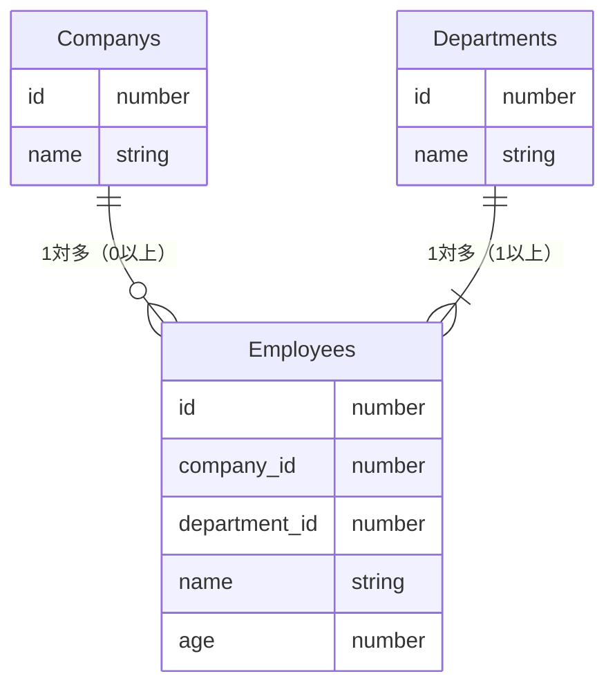
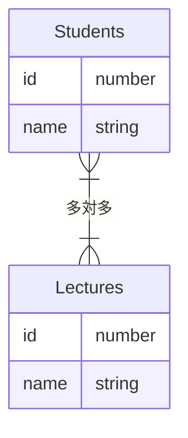
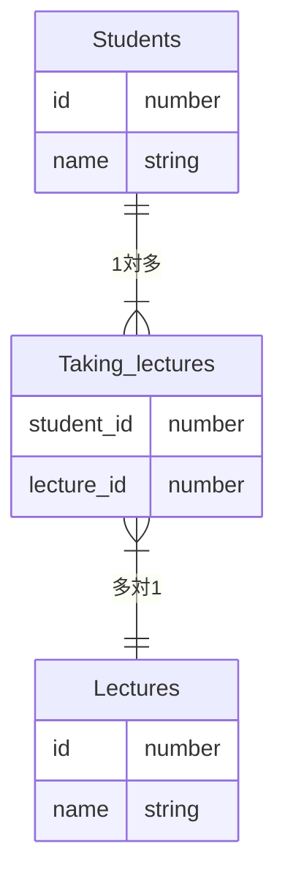

# ER図〜複数のテーブルの関係を表現する

学習者：m.sasaki

### テーブル数の増加
- テーブル同士の関係性が複雑化する
  - 関係性を図で表すER図を用いる

 

- ER図（Entity Relationship Diagram）実体関連図
  - E（Entity）・・・テーブル
  - R（Relationship）・・・関連
  - テーブル同士の関連図
  - 書き方
    - IE（Information Engineering）表記法
      - 「鳥の足」という通称
      - 直感的に関連を読みやすい
    - IDEF1X
      - 米国で規格化された表記法

 

### テーブル同士の関係性を見抜く
- **関連のパターン**
  - 1対1
    - あまり見ない関連
    - この場合1つのテーブルにまとめられる可能性が大きい
  - 1対多
    - 最もよくある関連
    - 1対多、0対多の関連があるがあるがまとめて「1対多」とする
      - 例：
        - 会社1つに対して社員は複数いる
        - 部署1つに対して社員は複数いる
  - 多対多
    - 特殊な関連

 

### ER図の書き方

- **mermaid記法**
  - 端の「|」 1を表現
  - } 多を表現
  - 内側の「|」 1以上を表現
  - 内側の「o」 0以上を表現
  - 「--」 繋がりを表現
  - 
  - エンティティA||--o{エンティティB
    - エンティティAが「1」に対して、エンティティBが「0以上の多」の関係
  - エンティティA||--|{エンティティB
    - エンティティAが「1」に対して、エンティティBが「1以上の多」の関係
  - エンティティA}|--o{エンティティB
    - エンティティAが「1以上の多」に対して、エンティティBが「0以上の多」の関係

 

**ER図**

**※3本足が鳥の足に似ていることから鳥の足と呼ばれている**

### 多対多の関連実体

**ER図**

 

- 多対多の関係が問題になる点
  - 共通のキーを持っていない
  - 共通のキーをもたせようとすると重複レコードが生まれる
  - 登録の際にも問題が発生

- **解決方法**
  - 関連実体
    - エンティティの間に作られる第3のエンティティ

 

**ER図**
