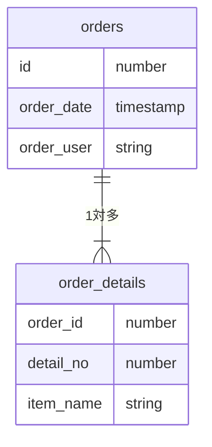

# 論理設計とパフォーマンス〜正規化の欠点と非正規化〜

学習者：m.sasaki

### 正規化の功罪
- 正規化の副作用
  - 正規化されたテーブル群に対するSQLのパフォーマンス劣化

- 正規化状態のテーブルでは
  - メリット
    - データ更新の際には常に低いコストで且つ一定
  - デメリット
    - データ検索する際に1つのデーブルで検索しきれなくなる
    - テーブルの結合は非常にコストの高い操作
      - テーブルのレコード数が増えると処理時間が増えていく

<br>

- 非正規化状態のテーブルでは
  - メリット
    - 結合を行わずにデータ検索を行える
  - デメリット
    - データ更新の際にコストが高くなる

<br>

**正規化と検索SQLのパフォーマンスは強いトレードオフの関係**

#### ※非正規化は最後の手段

---

### 非正規化とパフォーマンス

- **サマリデータの冗長性とパフォーマンス**

- Orders
    - 「受注」テーブル
        - id: 受注ID
        - order_date: 受注日
        - order_user: 注文社名義

<br>

- Orders_details
    - 「受注明細」テーブル
        - id: 受注ID
        - detail_no: 受注明細連番
        - item_name: 商品名

<br>

**ER図**


- 上記テーブルを使用して「受注日ごとに何個の商品が注文されているか」
  - 「受注日」列は「受注」テーブル
  - 「商品数」は「受注明細」から数える
    - 2つのテーブルの結合が必要

<br>

```sql
SELECT 
    order.order_date,
    COUNT(*) AS 商品数
FROM orders INNER JOIN order_details 
     ON order.id = order_details.id GROUP BY order.order_date
```

- 実際の業務では「受注明細」テーブルには膨大なレコードが格納されていると想定される
  - その場合上記SQLは大きいテーブル同士の結合をすることに
  - パフォーマンス上の問題を引き起こす可能性が高い

<br>

- 結合しないで「受注日ごとに何個の商品が注文されているか」を求めるには
  - 「受注」テーブルに「商品数」カラムを追加する
    - 追加することで推移的関数従属が生まれる
      - 第3正規化　→　第2正規化への非正規化

<br>

#### サマリデータを冗長に保持すると正規形に違反。ただし、検索を高速化

---

- **選択条件の冗長性とパフォーマンス**
  - 正規化したテーブルでは検索の際に選択の条件「検索したい受注期間」の選択の際にテーブル結合が必要
  - これを選択条件（この場合「受注日」）をテーブルに持たせることでテーブルの結合が不要になる場合がある
    - 第3正規化　→　第2正規化への非正規化を行うことになる
      - 検索は高速化できる

---

### 冗長性とパフォーマンスのトレードオフ
- 非正規化のリスク
  - 検索のパフォーマンスは向上するが、更新のパフォーマンスが低下
  - データのリアルタイム性（鮮度）が低下
  - 後続の工程で設計変更すると手戻りが大きい

<br>

- 更新時のパフォーマンス
  - 正規化していない場合更新レコードが膨大になるケースもある

<br>

- データのリアルタイム性
  - どの程度の最新性が求められるか
  - 最新性が求められるほどシステム負荷は増大

<br>

- 改修コストの大きさ
  - データモデルの変更はコードベースの修正よりも改修コストが非常に大きい

#### 論理層と物理層にすぐに精通は無理だと思うが、論理設計と物理設計の知識が必要になる
