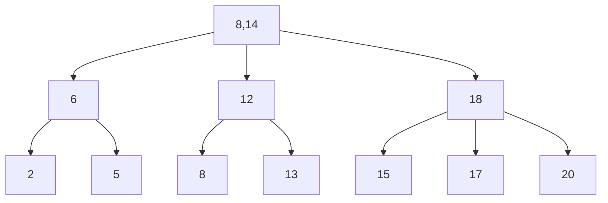
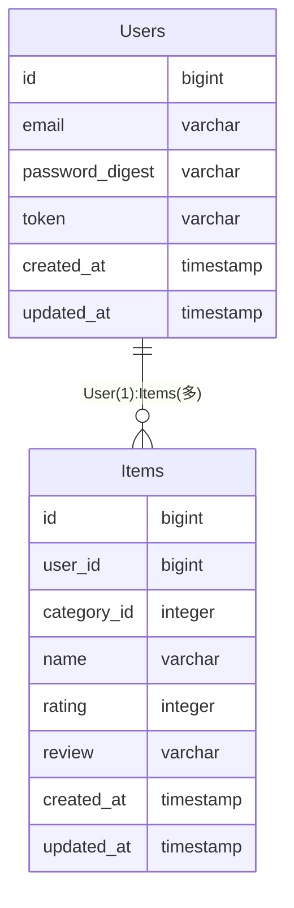

# データベースとパフォーマンス

学習者：m.sasaki

### データベースのパフォーマンスを決める要因
- インデックス
  - SQLチューニングとして最もポピュラー
    - 利用しないシステムはないレベル
    - （x「キー」, a「値：実データまたはポインタ」）という形式の配列
      - aはポインタであることが多い
    - DBMS内にテーブルとは別で独立したオブジェクト

<br>

- 統計情報
  - SQLのアクセスパスを決める最大の要因
  - DBMSはSQLからどのような経路でデータを探索するか自動判別する

---

### インデックス設計
- SQLのパフォーマンス改善でポピュラーな理由
  - アプリケーション透過的
    - アプリケーションのコードに影響を与えない
    - インデックスを使うかはDBMSが自動判別する
    - 「存在を意識しなくていい」　＝　「透過性」
  - データ透過的
    - テーブルのデータに影響を与えない
    - テーブルに格納されているデータに影響を与えない
    - テーブルに対しても「存在を意識しなくていい」 ＝　「透過性」
  - その上で性能改善の効果が大きい
    - インデックスの貼り方次第で劇的な効果を生み出す

<br>

- B-treeインデックス
  - 頻繁に利用するインデックス
  - これさえ覚えれば十分
  - 通常のDBMSでインデックスを作成するとB-treeインデックスが作成される
  - 長所
    - 他のインデックスと比較して全体的に平均より上の性能
      - 均一性
        - 各キー値の間で検索速度のばらつきが少ない
      - 持続性
        - データ量の増加に比してパーフォーマンス低下が緩やか
      - 処理汎用性
        - 検索、挿入、更新、削除のいずれの処理もそれなりの速度が出る
      - 非等値性
        - 等号以外に不等号を使ってもそれなりの速度が出る
      - 親ソート性
        - GROUP BY、ORDER BY、COUNT/MAX/MINなどのソートが必要な処理を高速化できる
  - 一点特化で優れているインデックスには負ける項目もあるが用途次第


**B-treeインデックスの構造**



- **均一性**
  - B-treeインデックスは平衡木
    - 平衡木
      - どのリーフもルートからの距離が一定の距離になる
        - 探索を同じ計算量で行える
    - 非平衡木
      - リーフの長さがバラバラ
        - データによって探索パフォーマンスが変わる
  - メンテナンスをしないで長期運用すると非平衡木になる

<br>

- **持続性**
  - 長期運用で劣化はする
    - それでも緩やかな速度で劣化するので持続性がある
      - B-treeは平べったい木を生成する為、劣化しにくい

<br>

- **処理汎用性**
  - 挿入、更新、削除のコストが検索と同じ
    - ビットマップインデックスは検索はB-treeより上だが、更新などは多大な時間を要する

<br>

- **非等値性**
  - 等号（＝）による検索以外にも、不等号（<,>,<=,>=）やBETWEEN等の範囲検索の条件に対しても高速化が可能
  - ただし否定条件（<>,!=）は効果なし
    - 非定型以外全てが検索条件のため

<br>

- **親ソート性**
  - インデックス構築時にキー値をソートして保持する
    - そのためソート処理をスキップする事が可能
      - データベースのパフォーマンスにとって鬼門のソート処理のチューニングを助けてくれる

---

### B-treeインデックスの設計方針
- **B-treeインデックスはどの列に対して作るのか**
  - 大規模なテーブル
  - カーディナリティの高い列
  - SQL文でWHERE区の選択条件、または結合条件に使用されている列

<br>

- **B-treeインデックスとテーブル規模**
  - データ量によってはB-treeよりもフルスキャンの方が高速な場合がある
    - 目安として1万レコード以下はほぼ効果がない

<br>

- **B-treeインデックスとカーディナリティ**
  - カーディナリティ
    - 特定の列の値がどのくらいの種類の多さをもつかという概念
    - 例：
      - 性別は男、女、不明の3つ
        - 非常に小さいカーディナリティの例
    - 全体のレコード数の5%に絞り込めるだけのカーディナリティがあると良い

#### カーディナリティ注意点
- 複合列に対してインデックスを作成する場合
  - カーディナリティは対象の複合列の組み合わせで考える
    - 例：
      - a,b,c単独で見た時にカーディナリティが低くても（a,b,c）の組み合わせで見てカーディナリティを考える
- カーディナリティが高くても、特定の値にデータが集中している時
  - B-treeの検索機能は安定しない
  - その事からカーディナリティが高くても登録されるデータが平均的にバラけている必要がある

---

### B-treeインデックスとSQL
- SQLで検索条件、結合条件に使用していない列にインデックスを作成
  - 無意味

<br>

#### SQL検索時の注意
- インデックス作成した列に手を加えると無意味になる

```sql
  #無意味な例
  SELECT * FROM Users WHERE age + 10 > 30;
```

```sql
  #修正例
  SELECT * FROM Users WHERE age > 20;
```

<br>

- 検索列にSQL関数を使用する

```sql
  #無意味な例
  SELECT * FROM Users WHERE SUBSTR(name, 1, 1) = 'a';

  # インデックスを作成したnameに対してではなく、nameの先頭文字一文字で比較しているため
```

<br>

- IS NULLの使用

```sql
  # 無意味な例
  SELECT * FROM Users WHERE name IS NULL;

  # NULLはデータの値とはみなさない
  # 一部のDBMSでは有効だが、汎用性はなし
```

<br>

- 否定形の使用

```sql
  # 無意味な例
  SELECT * FROM Users WHERE name <> 'taro';

  # 否定形はそれ以外の全てなので、検索対象が広すぎる
```

<br>

- ORの使用

```sql
  # 無意味な例
  SELECT * FROM Users WHERE name = "taro" OR name = "hanako"

  # ORを用いた場合はインデックスが利用されない
  # INに書き換えると回避可能

  SELECT * FROM Users WHERE name IN('taro', 'hanako');
```

<br>

- 後方一致、または中間一致の使用

```sql
  # 無意味な例
  SELECT * FROM Users WHERE name LIKE '%ro';
  SELECT * FROM Users WHERE name LIKE '%ar%';

  # 前方一致はインデックスが作用する
  SELECT * FROM Users WHERE name LIKE 'ta%';
```

<br>

- 暗黙の型変換

```sql
  # ageがINTEGER型で定義されていると仮定

  # 無意味な例
  SELECT * FROM User WHERE age = '10';

  # 有効な例
  SELECT * FROM User WHERE age = 10;
  SELECT * FROM User WHERE age = CAST('10', AS INTEGER);
```

#### その他注意事項
- 主キー、一意制約には作成不要
  - 主キーや一意制約の作成時に内部的にB-treeインデックスを作成している

<br>

- B-treeインデックスは更新性能を劣化させる
  - インデックスが作成されている対象列を変更するとインデックスで保持している値も変更しないといけない
    - インデックスを作成すればするほど該当テーブルの更新性のが劣化
    - 極力無駄なインデックスを作成しないこと

<br>

- 定期的なメンテナンスが必要
  - テーブルが更新されると構造が崩れてパフォーマンスが落ちる
    - そのため定期的にインデックスの再作成するのが望ましい

---

### 統計情報
- **オプティマイザと実行計画**
  - DBMSの頭脳
  - SQLのアクセスパス、実行計画を決める役割を担う
  - DBMSは統計情報を元に上記アクセスパス、実行計画を決める
    - カタログマネージャが統計情報を管理している


#### SQL実行計画はDBMSが「おまかせ」で選ぶ

---

### 統計情報の設計指針
- 統計情報収集タイミング
  - データが更新された後、なるべく早く
  - 原則夜間などの使用者が少ない時間

<br>

- 統計情報収集の対象（範囲）
  - 大きな更新のあったテーブルが対象
  - 処理負荷の高いものなので、必要なテーブルに絞って収集する必要がある

<br>

- 統計情報収集はそれなりに時間がかかる
  - データ更新量が少ない場合は統計情報を収集する意味が薄くなる

<br>

- 統計情報の凍結
  - 現状のものから実行計画を変化させたくない場合
    - 統計情報の更新を行わない（凍結）
      - 現在使用しているルートが将来に渡って最短ルートと判明している場合
  - オプティマイザの仕事を信用しない悲観的な考え方

---

### 個別調査
- INDEXの作成

```sql
  CREATE INDEX [インデックス名] ON [テーブル名(列名)]
```

**インデックス設定が適しているケース**
| 適しているケース | 理由 |
| :----: | :----: |
| 検索対象の表の行数が多い |  インデックスによる性能向上 |
| 検索対象の表において<br>検索項目の属性値に重複・偏りが少ない | インデックスによる性能向上 |
| 検索対象の表の更新が少ない | 検索対象の表の更新速度低下が少ない |
| 検索対象のひょうの追加・削除が少ない | インデックスの性能低下が起きにくい |

<br>

- 早くなる原理
  - 索引の働きをするメタデータの導入
  - 範囲検索の場合は検索した箇所の横のつながりから辿る
  - いくつかのレンジに区分けして検索効率を上げる


- 検索範囲が広すぎるとフルスキャンよりも効率が落ちることもある

- 複合インデックス
  - 左側のカラム（列）から順番に検索をかけていく
    - 下記テーブルのname、addressで複合インデックスを作成
      - name検索　→　address検索
        - address飲みの検索はフルスキャンになる



### インデックスを貼るときは効果的な列にピンポイントに。

- 課題アプリで考えてみる
  - ItemsテーブルのカテゴリIDまたはアイテム名で完全一致の物を取得
  - その他自身で登録したアイテム一覧の取得


- **Usersテーブル**
  - トークン列にインデックスを貼ることをのメリデメ
    - ログイン時のトークン一致の検索を想定
      - トークンに対してインデックスを作成

- **Itemsテーブル**
  - ユーザーID
    - 自身の登録したアイテム一覧取得を想定
  - カテゴリID
    - カテゴリ検索を想定。IDで完全一致
  - アイテム名
    - アイテム名検索を想定。アイテム名の完全一致
  - アイテム検索はアイテム名のみまたはカテゴリIDのみも許容している
    - そのため複合インデックスを無闇に作成するとどちらかのみでの検索はフルスキャンになる
      - 最初のサービス状況ではカテゴリIDは3つしかない為、フルスキャンの方が早くなる想定
      - カテゴリの増加数を想定してインデックスを作成するかしないかを考慮する必要がある
      - カテゴリが1万件を超えるかどうかを考慮する必要がある
        - 個人的な感覚だとカテゴリはそこまで増えない
      - アイテム名とユーザーIDでそれぞれ単独のインデックスを想定